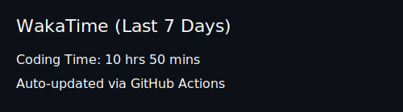
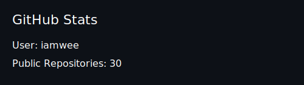

# 👋 Hi there

Mobile Developer | iOS • Android • Flutter  
Bangkok, Thailand 🇹🇭  

---

## 🚀 About Me
- 📱 iOS (UIKit, SwiftUI, Combine)
- 🤖 Android (Kotlin, Jetpack Compose, Coroutines)
- 🐦 Flutter (Riverpod)
- 🧱 Modular Architecture

---

## ⏱️ WakaTime Stats



---

## 📊 Weekly Coding Activity

<!--START_SECTION:waka-->

```txt
Kotlin           5 hrs 34 mins         ████████░░░░░░░░░░░░░░░░░   31.52 %
Other            4 hrs 6 mins          █████▓░░░░░░░░░░░░░░░░░░░   23.20 %
Swift            4 hrs 1 min           █████▓░░░░░░░░░░░░░░░░░░░   22.73 %
Markdown         1 hr 44 mins          ██▒░░░░░░░░░░░░░░░░░░░░░░   09.84 %
Dart             1 hr 14 mins          █▓░░░░░░░░░░░░░░░░░░░░░░░   06.97 %
```

<!--END_SECTION:waka-->

---

## 🛠 Tech Stack

### iOS


### Android


### Flutter


---

## 📈 GitHub Stats



---

## 📫 Connect With Me
- LinkedIn: (https://www.linkedin.com/in/iamwee/)
