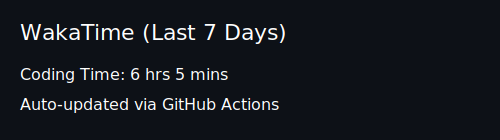
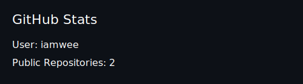

# 👋 Hi there

Mobile Developer | iOS • Android • Flutter  
Bangkok, Thailand 🇹🇭  

---

## 🚀 About Me
- 📱 iOS (UIKit, SwiftUI, Combine)
- 🤖 Android (Kotlin, Jetpack Compose, Coroutines)
- 🐦 Flutter (Riverpod)
- 🧱 Modular Architecture

---

## ⏱️ WakaTime Stats



---

## 📊 Weekly Coding Activity

<!--START_SECTION:waka-->

```txt
Kotlin           5 hrs 3 mins          ████████▒░░░░░░░░░░░░░░░░   33.95 %
Other            3 hrs 49 mins         ██████▒░░░░░░░░░░░░░░░░░░   25.68 %
Markdown         3 hrs 36 mins         ██████░░░░░░░░░░░░░░░░░░░   24.23 %
Swift            1 hr 30 mins          ██▓░░░░░░░░░░░░░░░░░░░░░░   10.10 %
CocoaPods        19 mins               ▓░░░░░░░░░░░░░░░░░░░░░░░░   02.23 %
```

<!--END_SECTION:waka-->

---

## 🛠 Tech Stack

### iOS


### Android


### Flutter


---

## 📈 GitHub Stats



---

## 📫 Connect With Me
- LinkedIn: (https://www.linkedin.com/in/iamwee/)
