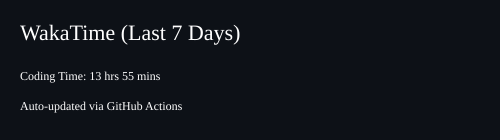
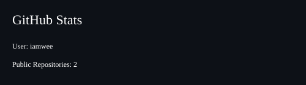

# 👋 Hi there

Mobile Developer | iOS • Android • Flutter  
Bangkok, Thailand 🇹🇭  

---

## 🚀 About Me
- 📱 iOS (UIKit, SwiftUI, Combine)
- 🤖 Android (Kotlin, Jetpack Compose, Coroutines)
- 🐦 Flutter (Riverpod)
- 🧱 Modular Architecture

---

## ⏱️ WakaTime Stats



---

## 📊 Weekly Coding Activity

<!--START_SECTION:waka-->

```txt
Markdown         5 hrs 30 mins         ████████░░░░░░░░░░░░░░░░░   31.91 %
Dart             5 hrs 6 mins          ███████▒░░░░░░░░░░░░░░░░░   29.58 %
Python           2 hrs 55 mins         ████▒░░░░░░░░░░░░░░░░░░░░   16.89 %
Bash             1 hr 21 mins          ██░░░░░░░░░░░░░░░░░░░░░░░   07.88 %
Text             1 hr 5 mins           █▓░░░░░░░░░░░░░░░░░░░░░░░   06.33 %
```

<!--END_SECTION:waka-->

---

## 🛠 Tech Stack

### iOS


### Android


### Flutter


---

## 📈 GitHub Stats


