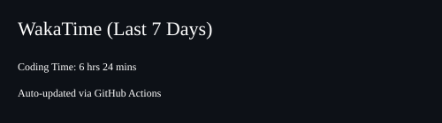
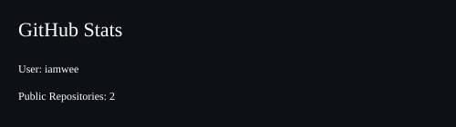

# 👋 Hi there

Mobile Developer | iOS • Android • Flutter  
Bangkok, Thailand 🇹🇭  

---

## 🚀 About Me
- 📱 iOS (UIKit, SwiftUI, Combine)
- 🤖 Android (Kotlin, Jetpack Compose, Coroutines)
- 🐦 Flutter (Riverpod)
- 🧱 Modular Architecture

---

## ⏱️ WakaTime Stats



---

## 📊 Weekly Coding Activity

<!--START_SECTION:waka-->

```txt
Markdown    7 hrs 24 mins         █████████░░░░░░░░░░░░░░░░   35.87 %
Python      3 hrs 32 mins         ████▒░░░░░░░░░░░░░░░░░░░░   17.13 %
Dart        2 hrs 11 mins         ██▓░░░░░░░░░░░░░░░░░░░░░░   10.61 %
Other       1 hr 51 mins          ██▒░░░░░░░░░░░░░░░░░░░░░░   08.99 %
Text        1 hr 47 mins          ██▒░░░░░░░░░░░░░░░░░░░░░░   08.68 %
```

<!--END_SECTION:waka-->

---

## 🛠 Tech Stack

### iOS


### Android


### Flutter


---

## 📈 GitHub Stats


